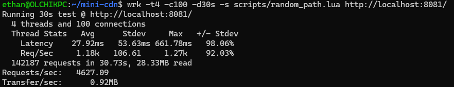
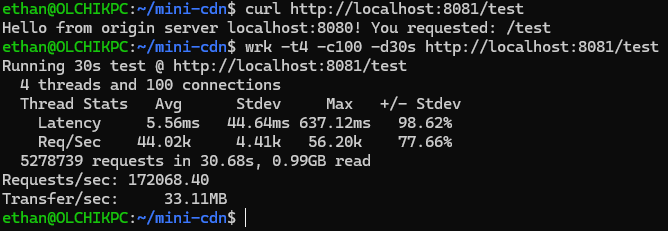

# mini-cdn
A reverse proxy and caching layer in Go with LRU eviction, per-entry TTL driven by `Cache-Control` headers, singleflight-based stampede protection, and round-robin load balancing with concurrent health checks.

---

## Benchmarks
### `wrk` benchmark
Benchmarked with `wrk` (-t4 -c100 -d30s) against a local origin with 20ms simulated latency:
| Scenario | Req/s | Avg Latency | Image |
|---|---|---|---|
| Cache MISS (unique URLs, always fetches from origin) | 4,627 | 27.92ms |  |
| Cache HIT (single primed URL, served from memory) | 172,068 | 5.56 |

**37x throughput improvement on cache hits.**

---

## Project Structure
 
```
mini-cdn/
├── cmd/
│   ├── main.go              # entry point — wires proxy, balancer, starts server
│   └── origin/
│       └── main.go          # test origin server with configurable latency
├── internal/
│   ├── proxy/
│   │   ├── proxy.go         # reverse proxy, caching, singleflight
│   │   └── proxy_test.go
│   ├── cache/
│   │   ├── cache.go         # LRU cache with per-entry TTL
│   │   └── cache_test.go
│   ├── balancer/
│   │   ├── balancer.go      # round-robin balancer with health checks
│   │   └── balancer_test.go
├── scripts/
│   └── random_path.lua      # wrk script for cache-miss benchmarking
├── assets/                  # contains images included in readme
├── go.mod
└── go.sum
```

---
 
## Running

### Requirements
- Go (v1.26.3+)
- Python3 (3.12.3+)
```bash
# Start a test origin on :8080
go run cmd/origin/main.go
 
# Start the proxy on :8081
go run cmd/main.go
 
# Test
curl -v http://localhost:8081/
```
Alternatively, you may also use the python scripts provided:
```bash
python3 scripts/start_origins.py
python3 scripts/start_proxy.py
```
The python scripts start the origin servers automatically on http://localhost on ports 8081-8085 inclusive. The proxy server starts automatically on port 8080.

If you want to run the origins/proxy on different ports, you may specify them as arguments like so:
```bash
python3 scripts/start_origins.py 2222 3333 4444 # start origins on ports 2222 3333 4444
# the http:// can be omitted as shown below
python3 scripts/start_proxy.py 1111 localhost:2222 http://localhost:3333 localhost:4444 # start proxy on port 0000 and point to origins
```

### Running Tests
 
```bash
go test -v ./internal/...
```

### Benchmarking
 
```bash
# Cache miss — unique URLs, always hits origin
wrk -t4 -c100 -d30s -s scripts/random_path.lua http://localhost:8081/
 
# Cache hit — prime the cache, then benchmark
curl http://localhost:8081/test
wrk -t4 -c100 -d30s http://localhost:8081/test
```
---